# Research: killing nonlinearities

[← Documentation hub](../README.md) · [← Repository root](../../README.md)

This is the canonical writeup of the research idea and method, followed by the
running **experiment log**. It doubles as the lab notebook: the formal method lives
at the top; what we actually learn from experiments accumulates in
[Experiment log](#experiment-log) below.

> **Status:** Phase 1a **in progress** — the regularizer, training, analysis, and
> masked-activation surgery are implemented (see the
> [phase-1a spec](../specs/2026-06-08-phase1a-regularizer-and-surgery-design.md)). Real
> MNIST/CIFAR results land in the [experiment log](#experiment-log) as runs complete.

---

## Table of contents

- [Motivation](#motivation)
- [The method](#the-method)
- [Why minimizing entropy enforces sign-consistency](#why-minimizing-entropy-enforces-sign-consistency)
- [Subtleties and failure modes](#subtleties-and-failure-modes)
- [From consistency to elimination](#from-consistency-to-elimination)
- [What we measure (phase 1)](#what-we-measure-phase-1)
- [Terminology](#terminology)
- [Roadmap](#roadmap)
- [Experiment log](#experiment-log)

---

## Motivation

A ReLU, `max(0, z)`, is only *nonlinear* for a neuron when that neuron's pre-activation
`z` is **positive for some inputs and negative for others**. If, across the data
distribution, a neuron's pre-activation always keeps the **same sign**, its ReLU does
nothing interesting:

- **Always positive** (`z > 0` for all inputs) → `ReLU(z) = z` → the unit is effectively
  **linear** (an identity passthrough).
- **Always negative** (`z < 0` for all inputs) → `ReLU(z) = 0` → the unit is **dead**
  (it can be removed).

Only neurons whose sign genuinely *switches* across inputs are doing nonlinear work.

This matters for two reasons:

1. **Interpretability.** Nonlinearities are what make networks hard to reason about. A
   layer whose ReLUs are all sign-consistent is a *linear* map on the data it actually
   sees, and linear maps are analyzable. If we can push most nonlinearity into a small,
   identifiable set of neurons, we localize where the "interesting" computation happens.
2. **Architecture.** Sign-consistent units are removable or collapsible. Replacing
   always-on ReLUs with identities lets consecutive linear layers fold into one; removing
   always-off units shrinks width. The result is a smaller, partially-linearized network
   with (ideally) similar behavior.

The hypothesis: **we can *encourage* a network to concentrate its nonlinearity** by adding
a regularizer that rewards sign-consistent pre-activations, then quantify how much
nonlinearity was actually unnecessary.

## The method

Take one ReLU site (a layer) with pre-activations $z \in \mathbb{R}^{B \times N}$ for a
batch of $B$ inputs and $N$ neurons; $z_{b,i}$ is neuron $i$'s pre-ReLU value for sample
$b$. The construction below applies independently at every regularized ReLU site and is
averaged over them.

**The forward pass is unchanged — it stays a plain ReLU:**

$$a_{b,i} = \mathrm{ReLU}(z_{b,i}) = \max(0,\, z_{b,i}).$$

The regularizer is a **pure side-computation** on the pre-activations $z$. It never alters
what the network computes; it only adds a term to the loss. This means there is **no
train/inference mismatch** — at inference the model is exactly the ReLU network it always
was.

**Step 1 — soft "fired positive" probability (temperature $\tau$).** The hard sign
$\mathrm{sign}(z)$ has zero gradient almost everywhere, so it cannot drive learning.
Replace it, *in the regularizer only*, with a temperature-scaled sigmoid:

$$s_{b,i} = \sigma\!\left(\frac{z_{b,i}}{\tau}\right), \qquad \sigma(u) = \frac{1}{1+e^{-u}}, \qquad \tau > 0.$$

$s_{b,i} \in (0,1)$ is a smooth, differentiable surrogate for "neuron $i$ fired positive on
sample $b$": $s \to 1$ when $z \gg 0$, $s \to 0$ when $z \ll 0$, and $s = \tfrac12$ at
$z = 0$. As $\tau \to 0^+$ it converges to the rescaled hard sign
$\tfrac{1}{2}(\mathrm{sign}(z)+1)$.

**Step 2 — batch-mean per neuron.** Average the surrogate over the batch to get, for each
neuron, the (soft) **fraction of the batch for which it fired positive**:

$$p_i = \frac{1}{B}\sum_{b=1}^{B} s_{b,i} \;\in\; (0,1).$$

$p_i$ is a differentiable Monte-Carlo estimate of $\Pr_{x\sim\text{data}}[\,z_i(x) > 0\,]$
(smoothed by $\tau$).

**Step 3 — binary entropy per neuron.**

$$H(p_i) = -\,p_i \log p_i - (1-p_i)\log(1-p_i).$$

$H$ is maximal at $p_i = \tfrac12$ (the neuron flips sign half the time — maximally
nonlinear) and approaches zero as $p_i \to 0$ or $1$ (perfect sign-consistency).

**Step 4 — the regularization loss.** Average the entropy over all $N$ regularized neurons
(and over all regularized layers $\ell$):

$$\mathcal{L}_{\text{reg}} = \frac{1}{|\mathcal{L}|}\sum_{\ell \in \mathcal{L}} \frac{1}{N_\ell}\sum_{i=1}^{N_\ell} H\!\big(p_i^{(\ell)}\big).$$

**Step 5 — the total objective.**

$$\mathcal{L} = \mathcal{L}_{\text{task}} + \lambda\, \mathcal{L}_{\text{reg}}, \qquad \lambda \ge 0.$$

We **minimize** $\mathcal{L}$. Minimizing $\mathcal{L}_{\text{reg}}$ drives every $p_i$
toward $0$ or $1$, i.e. toward sign-consistency. $\lambda$ is the central knob trading task
performance against how aggressively nonlinearities are removed.

**Temperature annealing.** Start with a larger $\tau$ (smooth surrogate, informative
gradients everywhere) and **anneal $\tau$ downward** over training, so the surrogate
sharpens toward the true sign as the consistent neurons emerge. $\tau$ and its schedule are
hyperparameters; see [Subtleties](#subtleties-and-failure-modes).

## Why minimizing entropy enforces sign-consistency

The *hard* statistic $q_i$ (and the soft $p_i$ in the $\tau \to 0$ limit) equals $0$ or $1$
**exactly** iff every sample in the batch lands on the same side of zero. At finite $\tau$ the
soft $p_i$ stays strictly inside $(0,1)$, but minimizing $H(p_i)$ drives it arbitrarily close
to an endpoint — and as $\tau$ anneals, "near an endpoint" becomes "sign-consistent." Any
mixture of signs holds $p_i$ away from the extremes at a positive entropy cost, so the
gradient pressure is directly toward "all-positive" or "all-negative" per neuron.

The gradient of the entropy w.r.t. $p$ (natural log) is

$$\frac{\mathrm{d}H}{\mathrm{d}p} = \log\!\frac{1-p}{p},$$

which is positive for $p < \tfrac12$ and negative for $p > \tfrac12$. Gradient descent on
$H$ therefore pushes $p$ **away from $\tfrac12$ toward whichever extreme it is already
nearer** — the batch "commits" to the side it currently leans toward. Note $p = \tfrac12$
is an *unstable* equilibrium with zero entropy gradient (see failure modes).

## Subtleties and failure modes

- **Soft/hard gap.** The regularizer optimizes the *soft* $p_i$, but elimination later uses
  the *hard* sign. The two agree only as $\tau \to 0$. Anneal $\tau$ so that, by the end of
  training, "soft sign-consistent" implies "hard sign-consistent." Validate with the hard
  statistic (next section), never the soft one.
- **The $p = \tfrac12$ unstable equilibrium.** A neuron whose batch is perfectly balanced gets no entropy
  gradient. In practice the task loss, mini-batch noise, and asymmetric initialization break
  the tie; a perfectly balanced average is measure-zero. Worth watching, not engineering
  around prematurely.
- **$\lambda$ too large → linear collapse.** Push hard enough and the network linearizes
  itself into the ground, destroying capacity and task accuracy. Too small and nothing
  happens. The interesting result is the **trade-off curve** (accuracy vs. fraction of
  neurons made consistent) as $\lambda$ sweeps.
- **Batch-size noise.** $p_i$ from a single mini-batch is a noisy estimate of the population
  sign-probability. A documented variant: maintain an **exponential moving average** of
  $p_i$ across batches for a lower-variance population estimate before applying entropy.
- **Temperature trade-off.** Large $\tau$: smooth, well-behaved gradients but a loose proxy
  for the sign. Small $\tau$: faithful to the sign but gradients vanish away from $z=0$.
  Annealing navigates between the two.
- **Biases and normalization.** The sign of $z$ depends on the learned bias (and on any
  BatchNorm/LayerNorm before the ReLU). The regularizer can satisfy itself by shifting biases
  to make signs consistent — usually the desired behavior, but something to keep in mind when
  interpreting results.
- **Alternative formulations (future variants).** Entropy of the batch-mean is the
  formulation specified here. Alternatives worth comparing: penalizing per-sample confidence
  $|s_{b,i} - \tfrac12|$, penalizing the variance of the sign across the batch, or a
  straight-through estimator on the hard sign. These are noted for later, not committed to.

## From consistency to elimination

> **Scope note.** Phase 1a is **analysis-first plus masked-activation surgery**: we implement
> the regularizer, *measure* sign-consistency and its cost, and perform surgery by flipping a
> neuron's activation **mode** (not by folding linear layers). **Linear-folding / structural
> pruning remains a later phase** — see the [roadmap](#roadmap).

After training, evaluate the **hard** fraction-positive of each neuron over a held-out set
of $M$ inputs:

$$q_i = \frac{1}{M}\sum_{m=1}^{M} \mathbb{1}[\,z_i(x_m) > 0\,].$$

Pick a tolerance $\varepsilon$ and classify:

| Condition | Meaning | Action (masked surgery) |
| --- | --- | --- |
| $q_i \ge 1-\varepsilon$ | consistently **positive** (ReLU ≈ identity) | set mode to `IDENTITY` → passthrough, unit becomes linear |
| $q_i \le \varepsilon$ | consistently **negative** (ReLU ≈ 0) | set mode to `ZERO` → unit is **dead** (outputs 0) |
| otherwise | genuinely nonlinear | keep `RELU` |

**Masked-activation surgery (what phase 1a does).** Rather than rewriting weights, we set a
per-neuron **mode** on a `SelectiveReLU`: an always-negative neuron ($q_i \le \varepsilon$) is
set to `ZERO` (its output is forced to 0, exactly as its ReLU already produced), and an
always-positive neuron ($q_i \ge 1-\varepsilon$) is set to `IDENTITY` (passthrough, linearizing
the unit). Genuinely nonlinear neurons keep `RELU`. The forward pass and weights are otherwise
untouched, so this is a clean, reversible measurement of *how much* nonlinearity was
unnecessary. **Linear folding** — collapsing $W_2(W_1 x + b_1) + b_2 = (W_2 W_1)x + (W_2 b_1 +
b_2)$ across adjacent linearized layers — and structural width pruning are deferred to a later
phase; phase 1a measures the accuracy-vs-k trade-off of masking alone.

### Selection-set-only losslessness

Masking a neuron is **exactly lossless only when its hard sign-entropy is truly zero** — i.e.
$q_i$ is **exactly** 0 or 1 (using the strict $z > 0$ predicate) on the set it was measured on.
A $q=0$ neuron set to `ZERO` is lossless even if some $z = 0$ in the batch (because
$\mathrm{ReLU}(0) = 0$); a $q=1$ neuron set to `IDENTITY` requires **all** $z > 0$ strictly. For
selected neurons with *interior* $q$ (chosen by how far down the ascending-entropy ranking we
cut), masking changes the logits, and the **accuracy-vs-k** curve measures that loss by design.
Crucially the guarantee is **on the selection set only**: held-out (test) inputs may push a
"consistent" neuron across zero, which is exactly why we report the val-vs-test accuracy-vs-k
gap.

### Gradient safety: the loss clamps p

The entropy's forward value is exactly 0 at $p \in \{0, 1\}$, but its derivative
$\mathrm{d}H/\mathrm{d}p = \log\frac{1-p}{p}$ diverges there. As $\tau$ anneals low, the soft
$p_i$ of a sign-consistent neuron saturates to *exactly* 0 or 1 in float32, so a naive
`loss.backward()` would inject NaN — destroying the model precisely when it succeeds.
Therefore the **loss** clamps $p$ into $[\varepsilon, 1-\varepsilon]$ before computing entropy
(clamp's backward is 0 outside the range, so saturated neurons get a finite zero gradient).
The `binary_entropy` function itself stays **unclamped** — the honest math — and is used by
**analysis** on the hard $q$ under `no_grad`, where the endpoint gradient never arises.

## What we measure (phase 1)

- **Consistency.** Fraction of neurons that are *eliminable* — $q_i$ within $\varepsilon$ of
  $0$ or $1$ — as a function of $\lambda$.
- **Trade-off.** Task accuracy vs. $\lambda$, and accuracy vs. fraction eliminable. This
  curve is the headline result.
- **Distribution of $q_i$.** A histogram of hard fraction-positive across neurons; we expect
  it to grow **bimodal** (mass piling at $0$ and $1$) as $\lambda$ increases.
- **Regularizer trajectory.** $\mathcal{L}_{\text{reg}}$ and the chosen $\tau$ schedule over
  training.

## Terminology

| Term | Definition |
| --- | --- |
| **Pre-activation** $z$ | the input to a ReLU (post-linear, pre-nonlinearity). |
| **Sign-consistent neuron** | a neuron whose pre-activation keeps the same sign across (nearly) all inputs. |
| **Soft fraction positive** $p_i$ | $\frac1B\sum_b \sigma(z_{b,i}/\tau)$ — differentiable, used in the loss. |
| **Hard fraction positive** $q_i$ | $\frac1M\sum_m \mathbb{1}[z_i>0]$ — the true statistic, used to classify/eliminate. |
| **Temperature** $\tau$ | sigmoid scale; small $\tau$ → sharper approximation of the sign. |
| **Strength** $\lambda$ | weight on $\mathcal{L}_{\text{reg}}$ in the total loss. |
| **Eliminable neuron** | a neuron whose ReLU can be replaced (passthrough) or removed (prune). |
| **Passthrough** | replacing an always-on ReLU with the identity, linearizing the unit. |

## Roadmap

Tracked work, roughly in order. (File these as GitHub issues — see
[contributing](../development/contributing.md#roadmap--issues).)

- [x] **Phase 0 — scaffold.** Tooling, test harness, docs (this repo).
- [~] **Phase 1a — regularizer + analysis + masked surgery on a toy MLP** (MNIST/CIFAR).
  *In progress.* $\mathcal{L}_{\text{reg}}$, τ-annealing, λ-sweep via wandb Sweeps, the
  trade-off curve, $q_i$ histograms, and masked-activation surgery (accuracy-vs-k on val+test)
  are implemented per the [phase-1a spec](../specs/2026-06-08-phase1a-regularizer-and-surgery-design.md).
  Models emit their own pre-activations (see [architecture](../architecture/overview.md)).
- [ ] **Phase 1b — small transformer (language modeling).** Apply the same regularizer to the
  MLP/FFN blocks of a small transformer.
- [ ] **Phase 2 — structural surgery.** Fold linearized layers and prune dead units; measure
  retained accuracy. (Phase 1a already does the *masked* form.)
- [ ] **Phase 3 — visualize the de-nonlinearized network.** Build tools to visualize the
  surgered/folded networks — which nonlinearities survive, what the folded linear maps
  compute — and study whether the sparser, folded-layer mechanisms are interpretable
  (what did the network *actually* need its remaining nonlinearity for?).
- [ ] **Phase 4 — range analysis across layers (LP/simplex).** From the input ranges and
  the weights, bound each neuron's pre-activation range by solving a per-neuron linear
  program (simplex), then propagate those bounds layer by layer through the whole
  network. (Interval/LP-based bound propagation in the spirit of NN-verification
  tooling; ranges also certify sign-consistency *for the whole input box*, not just the
  data sample — a stronger guarantee than the empirical $q_i$.)
- [ ] **Phase 5 — decompile to conditionals.** Use the range analysis to translate the
  weights + surviving nonlinearities into explicit conditionals (decision-tree-like
  structure): a ReLU whose range crosses zero is a branch; everything between branches
  is an affine map.

## Experiment log

> Newest entries on top. Each entry: date, what was tried, config (λ, τ schedule, model,
> data), result, and takeaway. Keep findings here so knowledge accumulates in one place.

### 2026-06-10 — per-position vs channel-pooled regularizer: aggregates congruent, fine structure differs exactly as predicted

- **Setup:** the channel-pooled arm (`RegConfig.granularity="channel"`,
  [`configs/cifar10-cnn-chanreg.json`](../../configs/cifar10-cnn-chanreg.json) —
  identical CNN/grid/seed to the per-position sweep below; only the loss pooling
  differs; analysis/surgery stay per-position in both). λ=0 reproduces the
  per-position λ=0 run *exactly* (val 0.7518, 1,113 dead) — same seed, reg
  inert — so all λ>0 differences are attributable to the pooling. Assets under
  `cifar10_cnn_chanreg_sweep*` (figures visually near-identical to the
  per-position arm's).
- **Result (aggregates are congruent).** At every λ the two arms match in
  accuracy and conversion within single-seed noise — e.g. λ=2: val 0.672 vs
  0.665, dead 8,974 vs 9,559, always-on 5,067 vs 5,537; λ=10: val 0.620 vs
  0.625, always-on 30,016 vs 31,188. The asymmetry flip (dead→always-on
  dominated) and the non-monotonic λ=10 recovery reproduce under both.
- **Result (the fine structure differs exactly as the incentive analysis
  predicted).** Within-channel statistics over the conv sites:
  - **Mixed-direction channels** (holding both exact-dead and exact-on
    positions — rewardable per-position, *unrewardable* under pooling): the
    per-position arm grows them (7 in conv2 at λ=5, 2 at λ=10); the channel arm
    produces **zero, at every λ and site**.
  - **Within-channel q-dispersion** is uniformly tighter under pooling (conv2:
    0.045 → 0.025 at λ=2, 0.027 → 0.002 at λ=5, 0.008 → 0.001 at λ=10) and
    **fully-saturated whole channels** are slightly more numerous (conv2 at
    λ=10: 50 vs 43; conv1: 17 vs 14) — more conv-foldable structure, as
    intended by that objective.
  - **Why aggregates still match:** even under the per-position objective,
    within-channel dispersion is already small (0.005–0.09) — a weight-tied
    filter on shared data statistics makes positions lean together naturally.
    The configuration the channel objective punishes (mixed-direction
    consistency) is *real but rare* (≤7 of 128 channels), so the two losses
    push in nearly the same direction nearly everywhere.
- **Takeaway:** per-position stays the right default — it measures scalar
  sign-consistency honestly and permits the (rare) richer configurations — while
  channel pooling is a viable *structured* variant that buys whole-channel
  saturation (useful when phase-2 folding wants conv-preserving structure) at no
  accuracy cost and no aggregate consistency loss. The original worry
  ("channel pooling forces entire channels to 1 or 0") is confirmed
  *mechanistically* (zero mixed channels, tighter dispersion) but turns out to
  be near-harmless *empirically* on CIFAR, because conv channels are largely
  direction-coherent anyway.

### 2026-06-10 — CIFAR-10 CNN λ sweep (per-position): the asymmetry flips, and nonlinearity concentrates in conv0

- **Setup:** first `ReLUCNN` sweep (per-position neuron semantics — see the
  [conv spec](../specs/2026-06-10-convolutional-relu-sites.md)): conv
  3→32→64→128 (3×3, pad 1, pool 2) → fc 256 → 10, 620k params, **57,600
  per-position neurons** (32,768 + 16,384 + 8,192 conv positions + 256 fc) /
  CIFAR-10 / 12 epochs / seed 0 / the 10-point λ grid / CPU (~10–17 min per
  run). Config: [`configs/cifar10-cnn.json`](../../configs/cifar10-cnn.json);
  assets under `cifar10_cnn_sweep*`. Baseline val **0.7518** / test **0.7505**
  (+23pp over the flat-MLP ceiling — the regularizer finally has real accuracy
  to protect).

  | λ | val acc | test acc | dead (q=0) | always-on (q=1) | H(q) < 0.05 | knee k (≤0.5pp val cost) |
  | --- | --- | --- | --- | --- | --- | --- |
  | 0.0 | 0.7518 | 0.7505 | 1113 | 0 | 1325 | 2880 |
  | 0.01 | 0.7520 | 0.7503 | 1170 | 0 | 1347 | 2880 |
  | 0.05 | 0.7438 | 0.7417 | 1189 | 0 | 1375 | 2880 |
  | 0.1 | 0.7444 | 0.7391 | 1316 | 0 | 1573 | 2880 |
  | 0.2 | 0.7480 | 0.7485 | 1718 | 0 | 1996 | 2880 |
  | 0.5 | 0.7414 | 0.7380 | 2409 | 0 | 3351 | 2880 |
  | 1.0 | 0.7282 | 0.7171 | 4624 | 104 | 7520 | 11520 |
  | 2.0 | 0.6648 | 0.6506 | 9559 | 5537 | 28463 | 28800 |
  | 5.0 | 0.5910 | 0.5914 | 7588 | 18468 | 44468 | 48960 |
  | 10 | 0.6252 | 0.6219 | 7198 | 31188 | 52311 | 51840 |

- **Findings:**
  1. **The CNN pays for consistency** — the first sloped trade-off curve in this
     project (the flat MLP was free through λ=10): flat through λ=0.5, then
     −2.4pp at λ=1, −8.7pp at λ=2, −16pp at λ=5, with a non-monotonic recovery
     at λ=10 (0.6252; single seed). Its nonlinearity is load-bearing.
  2. **The dead-vs-passthrough asymmetry flips.** Up to λ=1 conversion is
     dead-dominated (like every MLP run); from λ=5 it is **always-on dominated**
     (31,188 on vs 7,198 dead at λ=10 — 54% of all positions exactly always-on).
     Plausible mechanism: killing a conv position starves every downstream
     receptive field that reads it, while an always-on (locally linear) position
     keeps information flowing — under forcing pressure the CNN *linearizes
     rather than amputates*.
  3. **Nonlinearity concentrates in conv0.** Per-site near-consistency
     (H < 0.05 nats) at λ=10: conv1 **100.0%**, conv2 **99.2%**, fc0 **100.0%**
     (fc is two-thirds exactly dead) — while conv0 keeps **15.9% of its
     positions genuinely switching** (5,210 of 32,768). The trained-then-pressured
     CNN reorganizes into [one nonlinear pixel-adjacent feature layer] → [a
     near-linear deep pipeline]: exactly the "localize the nonlinearity"
     outcome phase 1 was hypothesizing, now visible at λ≥5.
  4. **No padding border-ring** (a falsified prediction): border vs interior
     conversion rates are nearly identical (λ=10 conv0 always-on: 61.5% border
     vs 54.9% interior; dead rates equal to ~1pp). Positional consistency is
     data/depth-structured, not boundary-driven.
  5. **Small λ barely moves the CNN** (1,113 → 2,409 dead across λ=0→0.5, no
     always-on at all) — unlike the MLP at the same strengths. Per-position conv
     consistency is expensive to manufacture: the bias is shared per channel, so
     the regularizer must work through the data's spatial statistics.
  6. The masking knee marches 2,880 → **51,840 of 57,600** (90% of positions
     maskable within 0.5pp of that run's baseline at λ=10). Knee values are
     k-grid-quantized (step 2,880).

  | Trade-off across λ | $q_i$ distribution across λ |
  | --- | --- |
  | 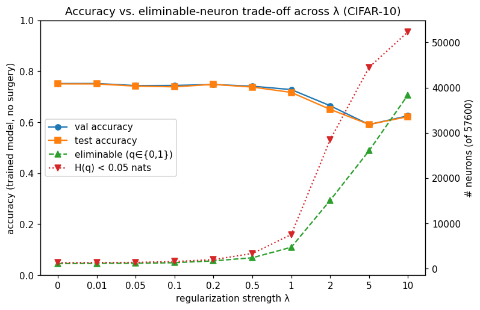 | 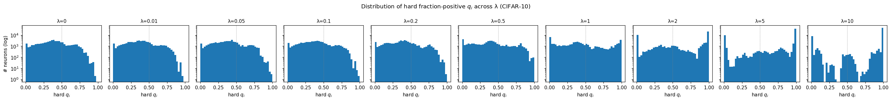 |

  | Accuracy vs k by λ | Val-accuracy surface over (k, λ) |
  | --- | --- |
  | 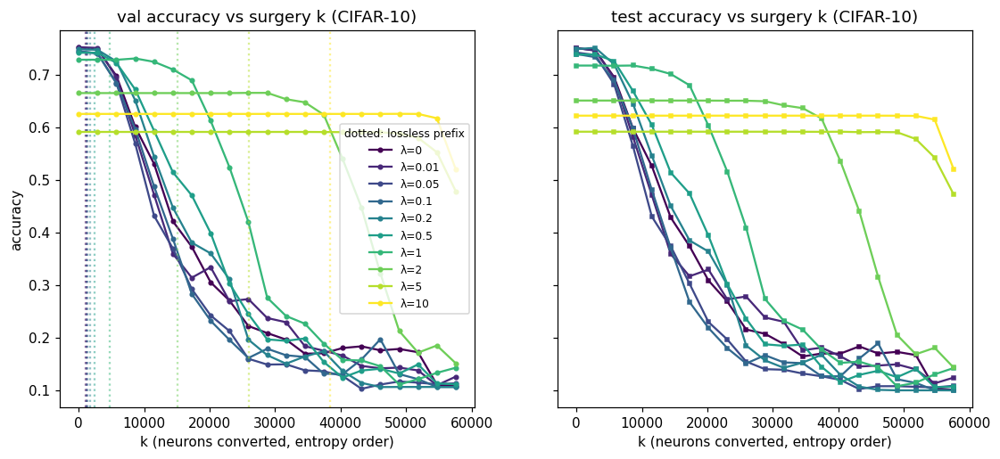 | 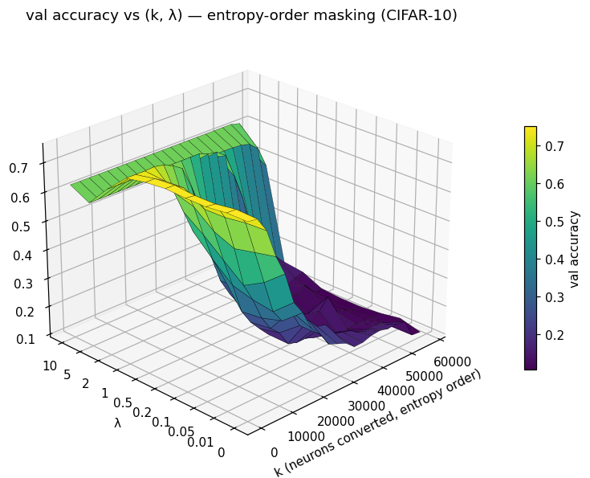 |

- **Takeaway:** on an architecture whose accuracy actually depends on its
  nonlinearity, the regularizer behaves qualitatively differently: it costs
  accuracy, it prefers passthrough over death (the reverse of the MLP), and it
  *concentrates* the surviving nonlinearity in the earliest layer rather than
  spreading thin. λ between 1 and 2 is the phase-change region to resolve next,
  plus multi-seed bands. The **channel-pooled regularizer arm**
  (`RegConfig.granularity="channel"`, same grid/seed,
  [`configs/cifar10-cnn-chanreg.json`](../../configs/cifar10-cnn-chanreg.json))
  is running for comparison — entry to follow.

### 2026-06-10 — λ pushed to 10 (no collapse, only linearization) + a 4×-wide CIFAR capacity check

- **Setup:** extended both λ-sweeps with **λ ∈ {2, 5, 10}** (the sweep script now *merges*
  new runs into an existing results JSON, keyed by λ, so only the new points were trained;
  all `lambda_sweep*` / `cifar10_lambda_sweep*` figures — including in the entry below —
  now render the full **10-point grid**). Separately, a **capacity check** for the ~52%
  CIFAR ceiling: [`configs/cifar10-wide.json`](../../configs/cifar10-wide.json) —
  3072→**1024→1024**→10 (4.9M params vs 0.85M), **30 epochs** (vs 10), same
  optimizer/τ/seed/batch — run at λ ∈ {0, 0.1} (assets under `cifar10_wide_sweep*`).
- **Result (λ → 10).** New grid points only (λ ≤ 1 in the entry below); *knee* = largest
  k within 0.5pp val of the unmasked model:

  | λ | val acc | test acc | eliminable (dead / on) | H(q) < 0.05 | knee k |
  | --- | --- | --- | --- | --- | --- |
  | MNIST 2 | 0.9405 | 0.9387 | 220 (146 / 74) | 504 | 486 |
  | MNIST 5 | 0.9078 | 0.9111 | 322 (176 / 146) | 511 | 486 |
  | MNIST 10 | 0.9053 | 0.9081 | 375 (214 / 161) | **512** | **512** |
  | CIFAR 2 | 0.5038 | 0.5045 | 170 (168 / 2) | 274 | 307 |
  | CIFAR 5 | 0.5056 | 0.4999 | 222 (199 / 23) | 369 | 384 |
  | CIFAR 10 | 0.4760 | 0.4878 | 274 (209 / 65) | 414 | 435 |

  1. **"λ too large" is a graceful asymptote to linearity, not a collapse.** At λ=10 MNIST
     has **every neuron sign-consistent** (512/512 below 0.05 nats) and val 0.9053 ≈ the
     linear-model floor (multinomial logistic regression on MNIST ≈ 0.92; ours is
     rank-256-bottlenecked) — and the knee reaches **k=512**: the *entire network* can be
     masked within 0.5pp. CIFAR holds ~0.50–0.52 through λ=5 and dips only to 0.476 at
     λ=10, with the knee marching 77 → **435/512** (85% maskable).
  2. **The dead-vs-passthrough asymmetry finally cracks at λ ≥ 2 on CIFAR** (cf. the
     analysis below): first exact q=1 units (2 → 23 → 65 across λ=2/5/10) and the first
     layer-1 eliminations ever (0 at λ≤1 → 82 converted at λ=10) — but conversion stays
     heavily dead-skewed (209 dead vs 65 on at λ=10). Eliminable is mildly non-monotonic
     (170 at λ=2 < 174 at λ=1): single-seed noise.
- **Result (wide CIFAR):** at λ=0, val **0.5240** / test **0.5245** vs the small model's
  0.5104 / 0.5261 — i.e. **5.8× parameters and 3× training bought ≈ +1pp val and nothing
  on test**. The ~52% is an *architecture* ceiling (flat MLP on raw pixels; logistic
  regression ≈ 0.40, well-tuned MLPs ≈ 0.55–0.60; the priors that move CIFAR are
  convolutional, not capacity). Sign-consistency findings scale with width: **506/2048
  neurons (25%) die naturally at λ=0** (all layer-2, as in the small net) and the
  unregularized knee is already **819/2048 (40%)**; λ=0.1 raises dead to **795 (39%)** at
  −1.6pp val, still zero always-on, and layer-1's q-ceiling *tightens* with width (max
  layer-1 q: 0.54 wide vs 0.58 small at λ=0).

  | Accuracy vs k, wide CIFAR (λ ∈ {0, 0.1}) | $q_i$ distribution, wide CIFAR |
  | --- | --- |
  | 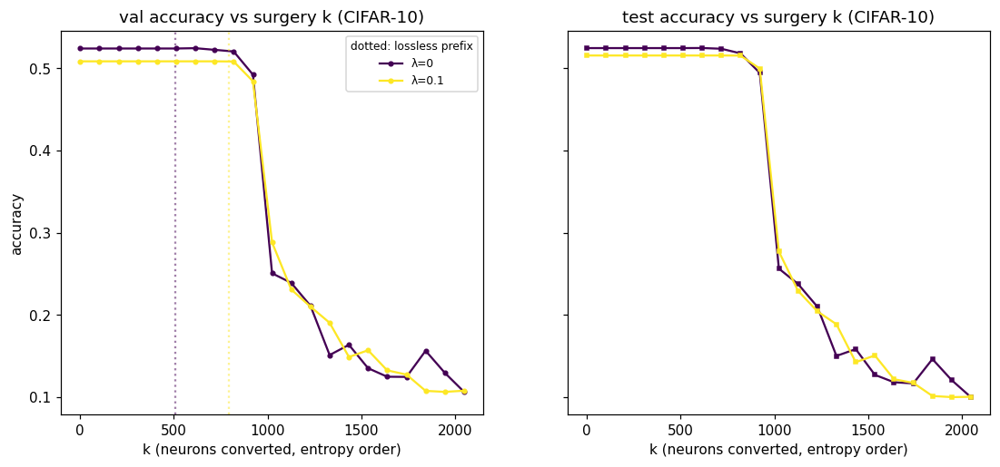 | 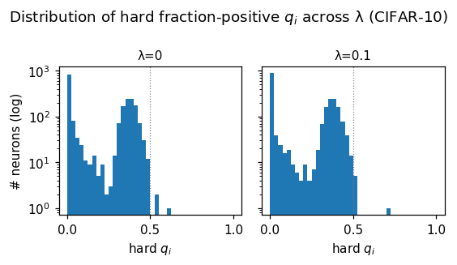 |
- **Takeaway:** λ is safe across three orders of magnitude — its λ→∞ limit is the
  network's best *linear* approximation, reached smoothly, and its real product is
  **surgery capacity** (the knee). CIFAR accuracy is not recoverable by width/epochs at
  this architecture, so the interesting next scale-up is **phase 1b (transformer FFNs)**,
  not bigger MLPs. Multi-seed error bands remain the top methodological gap.

### 2026-06-09 — CIFAR-10 λ sweep, (k, λ) surfaces, and the dead-vs-passthrough asymmetry

- **Setup:** both base configs ([`configs/mnist.json`](../../configs/mnist.json),
  [`configs/cifar10.json`](../../configs/cifar10.json) — same models / Adam lr 1e-3 / τ
  exponential 1.0→0.1 / seed 0 / CPU as the entries below) swept offline across an
  **extended grid λ ∈ {0, 0.01, 0.05, 0.1, 0.2, 0.5, 1.0}** via the generalized
  [`scripts/lambda_sweep.py`](../../scripts/lambda_sweep.py) (now takes
  `--config/--prefix/--lambdas/--plot-only`, saves per-neuron $q_i$ and the full
  accuracy-vs-k curve per λ, and renders the by-λ overlay, the 3D (k, λ) surface, and
  per-λ $q_i$ histograms). ~90 s per run on an M4 CPU. Env note: run on Python 3.13 (the
  documented floor fallback — `wandb`→`pydantic` fails to import on 3.14.0rc2).
- **Result (CIFAR-10):** baseline accuracy is **flat across the whole λ range** (the MLP's
  ~52% ceiling is capacity-, not nonlinearity-limited) while dead neurons grow 24 → 174
  (34% of the network). **Not a single neuron ever reaches exact $q=1$ — at any λ.**

  | λ | val acc | test acc | dead (q=0) | always-on (q=1) | H(q) < 0.05 | max $q_i$ | knee k (≤0.5pp val cost) |
  | --- | --- | --- | --- | --- | --- | --- | --- |
  | 0.0 | 0.5104 | 0.5261 | 24 | 0 | 40 | 0.592 | 77 |
  | 0.01 | 0.5130 | 0.5241 | 32 | 0 | 44 | 0.580 | 77 |
  | 0.05 | 0.5210 | 0.5251 | 54 | 0 | 68 | 0.573 | 77 |
  | 0.1 | 0.5166 | 0.5211 | 73 | 0 | 92 | 0.595 | 102 |
  | 0.2 | 0.4978 | 0.5237 | 98 | 0 | 113 | 0.710 | 154 |
  | 0.5 | 0.5162 | 0.5252 | 159 | 0 | 166 | 0.981 | 179 |
  | 1.0 | 0.5172 | 0.5199 | 174 | 0 | 209 | 0.999 | 230 |

- **Result (MNIST, same extended grid):** graceful degradation with **no collapse even at
  λ=1** (val 0.9763 → 0.9510), and — unlike CIFAR — **exact always-on units appear from
  λ=0.2** (50 → 68 of them), alongside 119 dead at λ=1. By λ=1, 494/512 neurons (96%) sit
  below 0.05 nats of sign-entropy and the ≤0.5pp-cost masking knee reaches **k=486 of 512**.

  | λ | val acc | test acc | dead (q=0) | always-on (q=1) | H(q) < 0.05 | max $q_i$ | knee k (≤0.5pp val cost) |
  | --- | --- | --- | --- | --- | --- | --- | --- |
  | 0.0 | 0.9763 | 0.9768 | 17 | 0 | 28 | 0.827 | 51 |
  | 0.01 | 0.9767 | 0.9796 | 45 | 0 | 48 | 0.935 | 51 |
  | 0.05 | 0.9743 | 0.9770 | 52 | 0 | 79 | 0.999 | 179 |
  | 0.1 | 0.9767 | 0.9786 | 69 | 0 | 196 | 0.9998 | 282 |
  | 0.2 | 0.9723 | 0.9723 | 84 | 50 | 353 | 1.0 | 384 |
  | 0.5 | 0.9683 | 0.9684 | 97 | 62 | 457 | 1.0 | 461 |
  | 1.0 | 0.9510 | 0.9542 | 119 | 68 | 494 | 1.0 | 486 |

  | Trade-off across λ (CIFAR-10) | $q_i$ distribution across λ (CIFAR-10) |
  | --- | --- |
  | 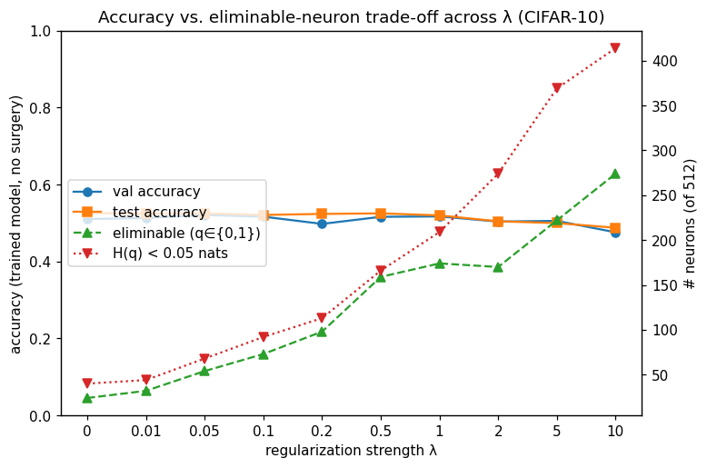 | 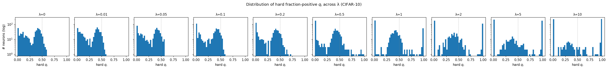 |

  | Accuracy vs k by λ (CIFAR-10) | Accuracy vs k by λ (MNIST) |
  | --- | --- |
  | 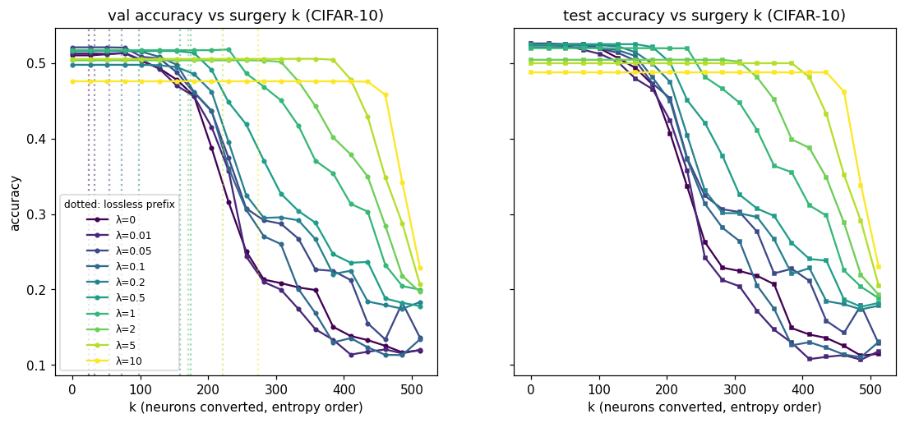 | 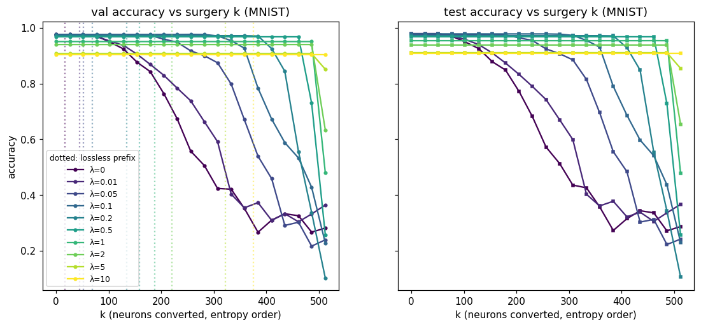 |

  | Val-accuracy surface over (k, λ) (CIFAR-10) | Val-accuracy surface over (k, λ) (MNIST) |
  | --- | --- |
  | 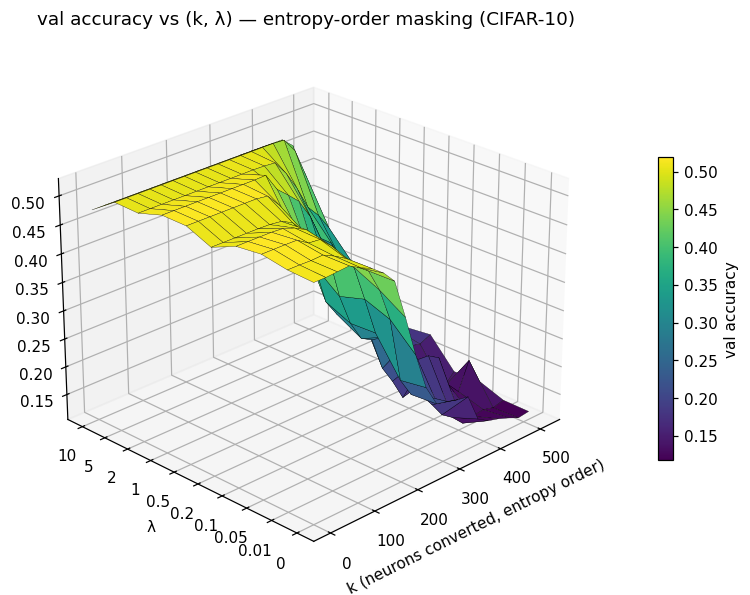 | 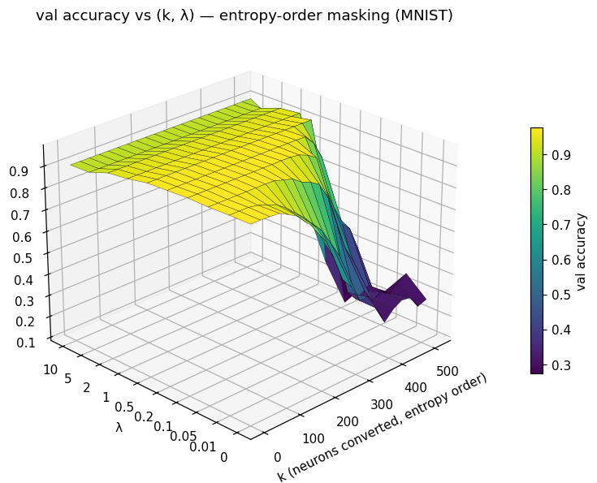 |

  | $q_i$ distribution across λ (MNIST) | Trade-off across λ (MNIST, regenerated) |
  | --- | --- |
  | 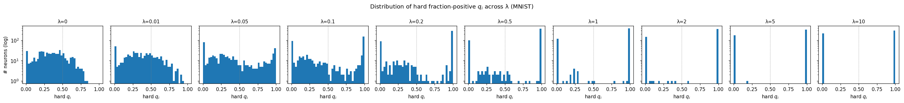 | 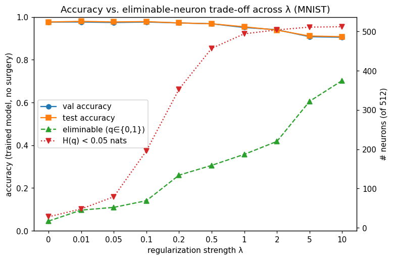 |

- **Why the CIFAR soft-vs-hard plot "stops at 0.5" (the dead-vs-passthrough asymmetry).**
  The λ=0.05 CIFAR scatter ends at $q \approx 0.57$ because **no neuron fires positive on
  more than ~57% of validation inputs** — a property of the data, not of the plot or the
  regularizer. Three measurements pin down the cause:
  1. **The ceiling exists at λ=0** (max $q$ = 0.592 with no regularizer): plain task
     training makes every CIFAR neuron a *selective* feature detector that fires on a
     minority of inputs. The regularizer only amplifies whichever side a neuron already
     leans toward (the entropy gradient $\log\frac{1-p}{p}$ pushes $p$ to its *nearer*
     endpoint), and on CIFAR the task leaves nothing leaning positive.
  2. **Initialization already differs by dataset geometry.** Untrained nets (seed 0):
     CIFAR layer-1 $q$ is pinned to [0.38, 0.61] — normalized natural images have high
     variance in every direction, so every random hyperplane splits them ~50/50 — while
     MNIST layer-1 $q$ spans [0.04, 0.98], because the shared constant background gives
     many weight directions a deterministic sign from birth. (Layer-2 $q$ starts wide,
     [0, 1], for both; CIFAR *training* then compresses it below 0.6.)
  3. **Per-layer split:** every exactly-eliminable CIFAR neuron at every λ is a
     **layer-2 dead unit**; layer 1 yields zero $q \in \{0,1\}$ neurons at any λ (its max
     $q$ is 0.73 even at λ=1). MNIST eliminates in both layers and converts both ways.

  Mechanistically the two endpoints are not symmetric: a dead unit is an **absorbing
  state** (no task gradient flows through an always-off ReLU, while the regularizer —
  acting on $z$ through $\sigma(z/\tau)$ — keeps pushing it deeper negative, unopposed),
  whereas exact $q=1$ is a **hard-margin constraint** ($z > 0$ strictly on *every* sample)
  that live task gradients keep perturbing — visible on MNIST as neurons hovering at
  $q = 0.999$ (λ=0.05) and 5999/6000 (λ=0.1) before exact $q=1$ units finally appear at
  λ≥0.2. On CIFAR the regularizer does drag a tail upward at high λ (max $q$: 0.59 → 0.98
  → 0.999 across 0.2/0.5/1.0) but never lands one.
- **Takeaway:** the regularizer enforces *consistency*; the task and data geometry choose
  *which sign*. On natural images at this scale "killing nonlinearities" currently means
  **pruning dead width, not linearizing passthroughs** — relevant for phase 2, since
  layer-folding needs $q=1$ units. If we want passthroughs on CIFAR, candidate knobs:
  positive bias init, slower/laxer τ anneal, or an endpoint-asymmetric penalty. The λ
  knob's real effect is on the **surgery curve**: the accuracy-vs-k knee moves from
  k=51 → 486 (MNIST) and k=77 → 230 (CIFAR-10) as λ goes 0 → 1, with the entire λ ≤ 1
  range essentially free on CIFAR and ≤2.5pp on MNIST. Single-seed counts at high λ are
  noticeably run-to-run sensitive (cf. λ=0.2 MNIST here vs. the 5-point sweep below);
  multi-seed bands are the next tightening step.

### 2026-06-09 — MNIST λ trade-off sweep (offline, 5 strengths)
- **Setup:** same MNIST ReLUMLP (784→256→256→10, 512 hidden neurons) / Adam lr 1e-3 / τ
  exponential 1.0→0.1 / 8 epochs / seed 0 / CPU, swept λ ∈ {0, 0.01, 0.05, 0.1, 0.2} offline
  via [`scripts/lambda_sweep.py`](../../scripts/lambda_sweep.py).
- **Result:** accuracy stays ~flat across the whole range while the count of sign-consistent
  neurons climbs steeply with λ:

  | λ | val acc | test acc | eliminable (q∈{0,1}) | H(q) < 0.05 nats |
  | --- | --- | --- | --- | --- |
  | 0.0 | 0.9762 | 0.9794 | 18 | 27 |
  | 0.01 | 0.9737 | 0.9763 | 45 | 47 |
  | 0.05 | 0.9778 | 0.9791 | 51 | 86 |
  | 0.1 | 0.9775 | 0.9766 | 73 | 226 |
  | 0.2 | 0.9715 | 0.9716 | 104 | 337 |

  

  *(Note: `lambda_sweep.png` / `lambda_sweep_results.json` were regenerated later the same
  day with the grid extended to λ ∈ {…, 0.5, 1.0} — see the entry above. Re-run counts
  differ from this table by a few neurons at the same λ: single-seed, thread-count-sensitive
  training.)*
- **Takeaway:** the regularizer buys a large increase in removable/near-linear capacity for a
  tiny accuracy cost — **exactly-eliminable neurons grow 18 → 104 (≈6×)** and near-consistent
  (H < 0.05 nats) neurons grow **27 → 337 (~⅔ of the network)** from λ=0 to 0.2, while accuracy
  drops only ~0.5% (val 0.9762 → 0.9715). Even the unregularized baseline (λ=0) already has 18
  dead neurons. **λ≈0.1 looks like the sweet spot** (73 exactly-eliminable / 226 low-entropy at
  no measurable accuracy cost). Accuracy is mildly non-monotonic at small λ (single seed —
  training noise). Next: the same sweep on CIFAR-10, and multi-seed runs to tighten the band.

### 2026-06-08 — MNIST λ>0 baseline (regularizer + masked surgery)
- **Setup:** ReLUMLP (784→256→256→10, 512 hidden neurons) / MNIST / λ=0.05 / τ exponential
  1.0→0.1 / Adam lr 1e-3 / 8 epochs / seed 0 / CPU. Config:
  [`configs/mnist.json`](../../configs/mnist.json). Run offline with `mode="disabled"`:
  `uv run python -m kill_nonlinearities.experiments.run --config configs/mnist.json`.
- **Result:** val acc **0.9778**, test acc **0.9791** (k=0, the untouched model). The
  regularizer drove the mean per-site sign-entropy down over training (final
  $\mathcal{L}_{\text{reg}}=0.392$). Of the 512 neurons, **51 reached exact $q=0$** (all dead;
  none hit $q=1$ at this λ) — the lossless-prefix marker — and **86 had sign-entropy < 0.05
  nats**. Masking those 51 via `ZERO` is **bit-exactly lossless on the selection set**: the
  acc-vs-k curve is flat (val 0.9778, test 0.9791) through k=51 and stays ≥ 0.977 through
  k≈128, then degrades smoothly (k=205: val 0.974; k=256: val 0.9522; all-512-masked collapses
  to ~0.30, chance-ish). The **entropy ranking dominates the random baseline** across the
  mid-range (k=256: 0.9522 vs 0.8162 random; k=179: 0.9775 vs 0.9440), confirming low-entropy
  neurons really are the cheap-to-remove ones. Val and test curves track within ~1% everywhere
  (small generalization gap).
- **Plots** (committed under [`assets/mnist-lambda/`](assets/mnist-lambda/); the
  9-frame `activation.gif` and `qi_bimodality.gif` are there too, plus regenerable in
  `runs/mnist-lambda/`):

  | Accuracy vs. surgery *k* (entropy vs. random) | Soft `pᵢ` vs. hard `qᵢ` |
  | --- | --- |
  | 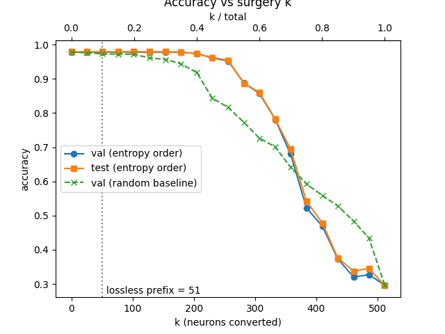 | 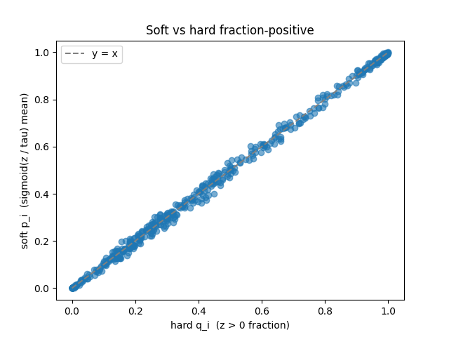 |

  | Mean pre-activation per neuron | Sign-entropy per neuron (sorted) |
  | --- | --- |
  | 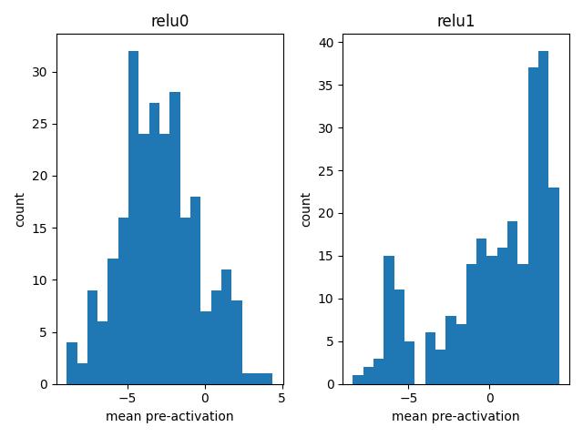 | 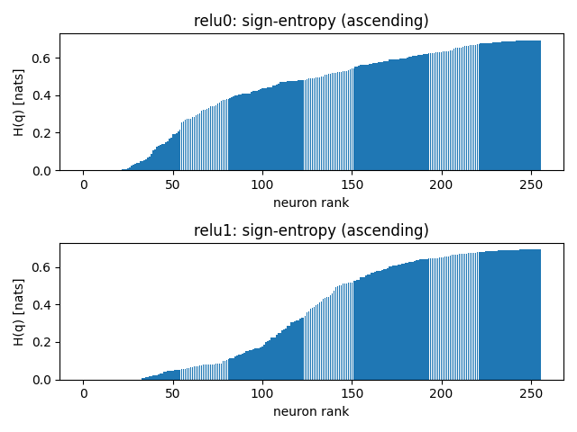 |

  | Training losses (task / reg / total) | Per-layer mean sign-entropy |
  | --- | --- |
  | 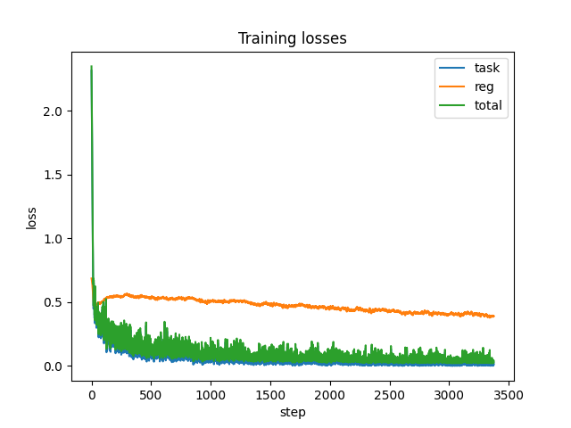 | 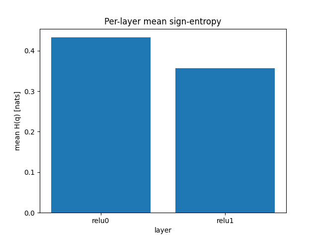 |
- **Takeaway:** at λ=0.05 about **10% of neurons (51/512) are exactly removable with zero
  accuracy cost**, and ~25–40% can be masked for a few points of accuracy — the entropy
  ranking is the right knob (it beats random masking by a wide margin mid-curve). At this λ the
  pressure produced dead ($q=0$) units rather than passthrough ($q=1$) ones. Next: sweep λ to
  push more neurons to the endpoints and grow the bimodal $q_i$ split, and run the deeper
  CIFAR-10 MLP.

### 2026-06-09 — CIFAR-10 λ>0 (regularizer + masked surgery)
- **Setup:** ReLUMLP (3072→256→256→10, 512 hidden neurons) / CIFAR-10 / λ=0.05 / τ exponential
  1.0→0.1 / Adam lr 1e-3 / 10 epochs / seed 0 / CPU. Config:
  [`configs/cifar10.json`](../../configs/cifar10.json). Run offline:
  `uv run python -m kill_nonlinearities.experiments.run --config configs/cifar10.json`.
- **Result:** val acc **0.5058**, test acc **0.5195** (k=0) — the expected ceiling for a flat MLP
  on CIFAR-10. Of 512 neurons, **55 reached exact $q\in\{0,1\}$** (the lossless prefix) and **76
  had sign-entropy < 0.05 nats** — *comparable sign-consistency to MNIST at the same λ, on a much
  harder task.* Masking the 55 entropy-0 neurons is bit-exactly lossless on the selection set;
  accuracy holds (~0.51) through k≈100 then degrades. The entropy ranking dominates the random
  baseline in the accuracy-preserving low-/mid-k regime (e.g. k≈150: ~0.49 val vs ~0.41 random),
  but the curves **cross at high k** (k≳250 random edges ahead) — there entropy-order is forced to
  convert the genuinely-nonlinear, high-entropy neurons it kept for last, and both collapse toward
  chance (~0.14) as k→512. Unlike MNIST, the per-neuron mean-pre-activation histograms are
  unimodal (negative-shifted), not cleanly bimodal — less clean dead/passthrough specialization on
  the harder task. Plots:

  | Accuracy vs. *k* (val / test / random) | Sign-entropy per neuron |
  | --- | --- |
  | 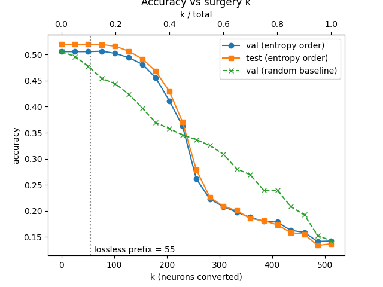 | 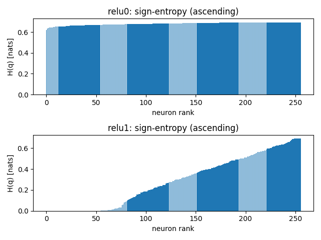 |

  | Mean pre-activation per neuron | Soft `pᵢ` vs. hard `qᵢ` |
  | --- | --- |
  | 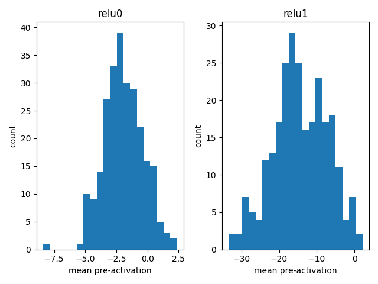 | 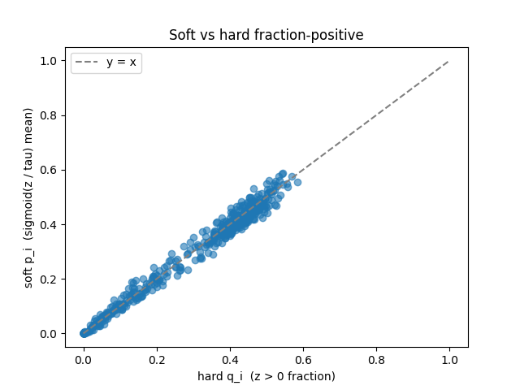 |

  (Full set incl. loss curves + the two GIFs under
  [`assets/cifar10-lambda/`](assets/cifar10-lambda/).)
- **Takeaway:** the method **transfers to CIFAR-10** — a similar count of sign-consistent neurons
  (55 exactly-eliminable), and the lossless-prefix + entropy-beats-random story holds in the
  accuracy-preserving regime, just at the MLP's ~52% ceiling. The high-*k* entropy/random crossing
  is sharper than on MNIST. For an online run / hyperparameter sweep with wandb, set
  `"mode": "online"` in the config (`uv run wandb login` first) and use
  [`scripts/launch_sweep.py`](../../scripts/launch_sweep.py).

```
### YYYY-MM-DD — <one-line title>
- **Setup:** model / data / λ / τ schedule / seed
- **Result:** numbers, plots (link artifacts)
- **Takeaway:** what we now believe, and what to try next
```

---

[← Documentation hub](../README.md) · [Development docs →](../development/README.md) · [Architecture →](../architecture/overview.md)
